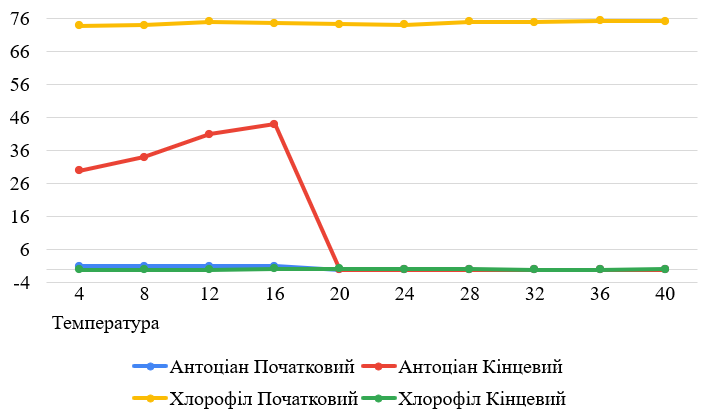
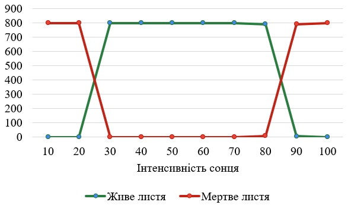
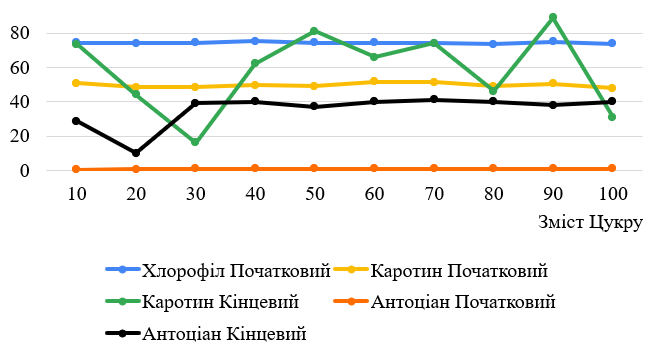

## Комп'ютерні системи імітаційного моделювання

## СПм-22-4, **удянський Роман**

### Лабораторна робота №**1**. Опис імітаційних моделей та проведення обчислювальних експериментів

### Варіант 11, модель у середовищі NetLogo:

[Autumn](https://www.netlogoweb.org/launch#http://www.netlogoweb.org/assets/modelslib/Sample%20Models/Biology/Autumn.nlogo)

### Вербальний опис моделі:

Ця модель відтворює процес зміни кольору листя та його опадання з дерев протягом осені. У регіонах із теплим літом і холодною зимою листя змінює забарвлення перед тим, як опадати. Завдяки моделі можна досліджувати сезонні явища та аналізувати вплив різноманітних чинників, таких як температура, тривалість світлового дня та інші внутрішні й зовнішні умови.

### Керуючі параметри:

- **number-of-leaves** - цей параметр вказує, скільки листів буде присутньо в середовищі під час запуску симуляції. Змінюючи значення "number-of-leaves" за допомогою
  відповідного слайдера, маємо змогу впливати на кількість листів, які будуть проходити етапи під час виконання симуляції.
- **start-sugar-mean** - цей параметр вказує, яке середнє значення для змісту цукру серед листя.
- **start-sugar-stddev** - цей параметр вказує, розподіл початкового розподілу цукру серед листя.
- **temperature** - цей параметр вказує, на температуру навколишнього середовища.
- **rain-intensity** - цей параметр вказує, на інтенсивність дощу.
- **wind-factor** - цей параметр вказує, на силу вітру навколишнього середовища.
- **sun-intensity** - цей параметр вказує, на інтенсивність впливу сонця.

### Внутрішні параметри:

- **water-level** - відображає кількість води в листі.
- **sugar-level** - показує кількість цукру в листі.
- **attachedness** - визначає, наскільки тісно лист прикріплений до дерева.
- **chlorophyll** - відображає рівень хімічних речовин, що забарвлюють листя в зелений колір.
- **carotene** - визначає рівень хімічних речовин, які надають листю жовтий колір.
- **anthocyanin** - показує рівень хімічних речовин, які забарвлюють листя в червоний колір.
- **location** - показує місце знаходження капель дощу, може бути "падає", "у коренях", "у стовбурі" чи "у листі".
- **amount-of-water** - показує кількість води.
- **bottom-line** - визначає, де знаходиться поверхня землі.
- **evaporation-temp** - температура, при якій вода випаровується.

### Показники роботи системи:

- **Leaves**: графік відображення двох показників живих листів та мертвих листів (які впали на землю).
- **Weather conditions**: графік відображення погодних умов таких як: дощ, сонце, температура, вітер.
- **Leaf averages**: графік відображення середніх значень змісту таких складників таких як: хлорофіл, вода, цукор, каротин, антоціан, приєднання (міцність з якою
  тримається лист).

### Примітки:

За середньої інтенсивності сонця та температури, наближеної до 0°C, листя залишається на дереві значно довше, оскільки сонячне світло відіграє ключову роль у цьому процесі.
У відсутність вітру невелика частка листя може залишатися на дереві протягом тривалого часу.
Цей проєкт ілюструє, що процес листопаду залежить від багатьох факторів: вмісту цукру в листі, вітру, сонячного світла та дощу.

### Недоліки моделі:

- При відсутності вітру листя не падають майже ніколи.
- Дощ не впливає на час через який листя впадуть, в реальному житті від капель які бʼють по листя цей процес існує.
- При максимальному дощі не з'являються калюжи.
- Листя стають жовтим рівномірно, не спочатку зовнішні, які захищають внутрішні від природного впливу, а рівномірно

## Обчислювальні експерименти

### 1. Вплив температури на показники Антоціану та Хлорофіл в змісті листя

Досліджується залежність впливу температури на зміст листя через 50 тактів.
Експерименти проводяться при 4-40 °C, з кроком 4, усього 10 симуляцій.  
Інші керуючі параметри мають значення за замовчуванням:

- **number-of-leaves**: 500
- **start-sugar-mean**: 50
- **start-sugar-stddev**: 25
- **rain-intensity**: 15
- **wind-factor**: 5
- **sun-intensity**: 80

<table>
<thead>
<tr><th>Температура</th><th>Хлорофіл Початковий</th><th>Хлорофіл Кінцевий</th><th>Антоціан Початковий</th><th>Антоціан Кінцевий</th></tr>
</thead>
<tbody>
<tr><td>4</td><td>73.8</td><td>0</td><td>1</td><td>30</td></tr>
<tr><td>8</td><td>74</td><td>0</td><td>1</td><td>34</td></tr>
<tr><td>12</td><td>75</td><td>0</td><td>1.1</td><td>41</td></tr>
<tr><td>16</td><td>74.6</td><td>0.3</td><td>1</td><td>44</td></tr>
<tr><td>20</td><td>74.2</td><td>0.3</td><td>0</td><td>0</td></tr>
<tr><td>24</td><td>74.1</td><td>0.2</td><td>0</td><td>0</td></tr>
<tr><td>28</td><td>75</td><td>0.1</td><td>0</td><td>0</td></tr>
<tr><td>32</td><td>74.9</td><td>0.03</td><td>0</td><td>0</td></tr>
<tr><td>36</td><td>75.3</td><td>0</td><td>0</td><td>0</td></tr>
<tr><td>40</td><td>75.1</td><td>0.2</td><td>0</td><td>0</td></tr>
</tbody>
</table>

Висновки експерименту:

- Зі збільшенням температури частина хлорофілу постійно зростала поступово, але кінцеві значення мали маленьку різницю та зростали також в залежності від температури
- [4-16] °C - значення як початкового, так і кінцевого хлорофілу поступово зростає
- Після певної межі у 20°C значення відсутні як на початку, так і наприкінці симуляції

### 2. Вплив інтенсивності сонця на впадання листя

Досліджується залежність впливу сонця на випадання листя через 50 тактів.
Експерименти проводяться при 10-100 % інтенсивності сонця, з кроком 10, усього 10 симуляцій.  
Інші керуючі параметри мають значення за замовчуванням:

- **number-of-leaves**: 800
- **start-sugar-mean**: 50
- **start-sugar-stddev**: 25
- **temperature**: 20
- **rain-intensity**: 17
- **wind-factor**: 5

<table>
<thead>
<tr><th>Інтенсивність сонця</th><th>Живе листя</th><th>Мертве листя</th></tr>
</thead>
<tbody>
<tr><td>10</td><td>0</td><td>800</td></tr>
<tr><td>20</td><td>0</td><td>800</td></tr>
<tr><td>30</td><td>800</td><td>0</td></tr>
<tr><td>40</td><td>800</td><td>0</td></tr>
<tr><td>50</td><td>800</td><td>0</td></tr>
<tr><td>60</td><td>800</td><td>0</td></tr>
<tr><td>70</td><td>800</td><td>0</td></tr>
<tr><td>80</td><td>792</td><td>8</td></tr>
<tr><td>90</td><td>7</td><td>793</td></tr>
<tr><td>100</td><td>0</td><td>800</td></tr>
</tbody>
</table>

Висновки експерименту:

- Листя дуже чутливе до інтенсивності сонця, сонця впливає одразу на те, щоб листя заливалось живим та на те, щоб листя ставало жовтим та померло скоріше
- При інтенсивності 10-20 % листю не достатньо сонця та померле дуже швидко.
- При інтенсивності 30-80 % листю достатньо сонця та процес помирання листя проходить повільно.
- При інтенсивності 90-100 % листю забагато сонця та процес помирання листя дуже швидко, але повільніше ніж при не достачі сонця.

### 3. Вплив змісту цукру на показники Хлорофілу(зелений кольор), Каротину(жовтий кольор) та Антоціану(червоний кольор) в змісті листя

Досліджується залежність змісту цукру на показники Хлорофілу, Каротину та Антоціану в змісті листя (зміну кольору листя) за 75 тактів.
Експерименти проводяться при 10 - 100 % змісту цукру, з кроком 10, усього 10 симуляцій.  
Інші керуючі параметри мають значення за замовчуванням:

- **number-of-leaves**: 800
- **start-sugar-stddev**: 25
- **temperature**: 11
- **rain-intensity**: 19
- **wind-factor**: 3
- **sun-intensity**: 97

<table>
<thead>
<tr><th>Зміст Цукру</th><th>Хлорофіл Початковий</th><th>Хлорофіл Кінцевий</th><th>Каротин Початковий</th><th>Каротин Кінцевий</th><th>Антоціан Початковий</th><th>Антоціан Кінцевий</th></tr>
</thead>
<tbody>
<tr><td>10</td><td>74,3</td><td>0</td><td>50,79</td><td>73,5</td><td>0,63</td><td>28,5</td></tr>
<tr><td>20</td><td>74,2</td><td>0</td><td>48,5</td><td>44</td><td>0,78</td><td>10</td></tr>
<tr><td>30</td><td>74,3</td><td>0</td><td>48,5</td><td>16</td><td>0,9</td><td>39</td></tr>
<tr><td>40</td><td>75,2</td><td>0</td><td>49,7</td><td>62</td><td>0,95</td><td>40</td></tr>
<tr><td>50</td><td>74,5</td><td>0</td><td>49,1</td><td>81</td><td>0,97</td><td>37</td></tr>
<tr><td>60</td><td>74,3</td><td>0</td><td>51,5</td><td>66</td><td>1</td><td>40</td></tr>
<tr><td>70</td><td>74</td><td>0</td><td>51,2</td><td>74</td><td>1</td><td>41</td></tr>
<tr><td>80</td><td>73,6</td><td>0</td><td>49</td><td>46</td><td>1</td><td>40</td></tr>
<tr><td>90</td><td>74,9</td><td>0</td><td>50,6</td><td>89</td><td>1</td><td>38</td></tr>
<tr><td>100</td><td>73,9</td><td>0</td><td>47,7</td><td>31</td><td>1</td><td>40</td></tr>
</tbody>
</table>

Висновки експерименту:

- Збільшення змісту цукру не впливає на те, що листя може залишитися зеленуватим.
- Збільшення змісту цукру приводило до того, що зміст каротину та антоціану збільшувався, листя починало приймати жовто-червоний окрас раніше та більше.
- Каротин змінювався не поступово, значення мали велику розбіжність 
