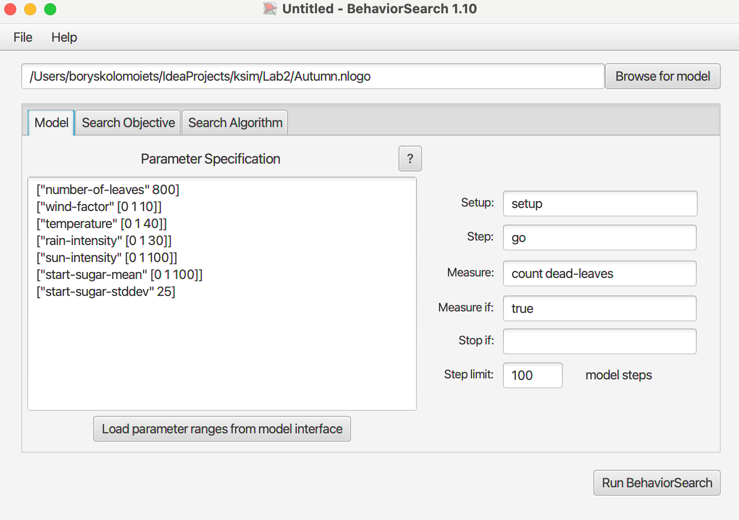
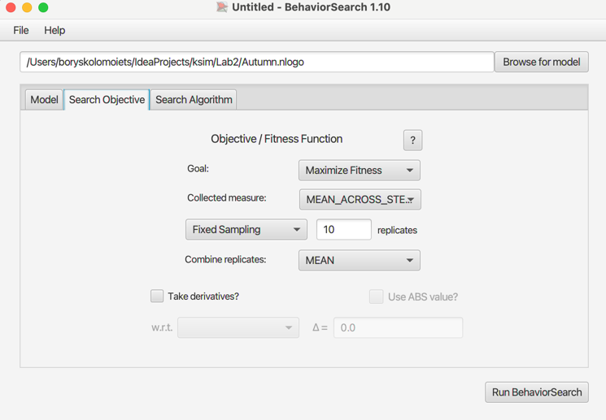
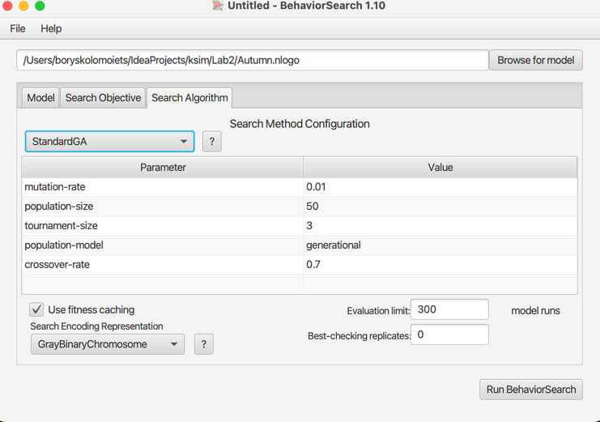
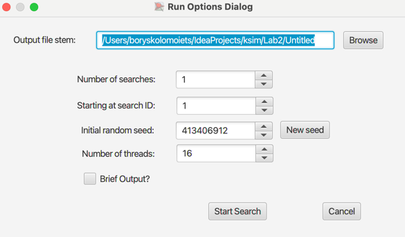

## Комп'ютерні системи імітаційного моделювання

## СПм-23-4, **Удянський Роман**

### Лабораторна робота №**3**. Використання засобів обчислювального інтелекту для оптимізації імітаційних моделей

 

### Варіант 11, модель у середовищі NetLogo:

[Autumn](http://www.netlogoweb.org/launch#http://www.netlogoweb.org/assets/modelslib/Sample%20Models/Biology/Autumn.nlogo)

 

#### Вербальний опис моделі:

- **[Вербальний опис моделі лабораторна робота №1](https://github.com/BorisKolomoiets/ksim/blob/main/Lab1/lab1_autumn.md#%D0%B2%D0%B5%D1%80%D0%B1%D0%B0%D0%BB%D1%8C%D0%BD%D0%B8%D0%B9-%D0%BE%D0%BF%D0%B8%D1%81-%D0%BC%D0%BE%D0%B4%D0%B5%D0%BB%D1%96)**

 

### Налаштування середовища BehaviorSearch:

**Обрана модель**:
<pre>
/Users/boryskolomoiets/IdeaProjects/ksim/Lab2/Autumn.nlogo
</pre>
**Параметри моделі** (вкладка Model):

<pre>
["number-of-leaves" 800]
["wind-factor" [0 1 10]]
["temperature" [0 1 40]]
["rain-intensity" [0 1 30]]
["sun-intensity" [0 1 100]]
["start-sugar-mean" [0 1 100]]
["start-sugar-stddev" 25]
</pre>

number-of-leaves було встановлено в значення 800 та start-sugar-stddev у значення 25. Для спрощення виконання алгоритмів.
 
 
Використовувана **міра**:  
Для фітнес-функції було обрано **кількість мертвого листя** враховуючи багато факторів впливу на то, з якою швидкістю помре листя.
<pre>
  count dead-leaves
</pre>

За цим показником можна спостерігати, при яких значеннях ефективність випадання листя буде найсильнішим.

Ефективність випадання листя повинна враховуватися **в середньому** за весь період симуляції тривалістю 100 тактів (адже на кожному такті є своя кількість мертвого листя),
починаючи з 0 такту симуляції.

Параметр зупинки за умовою (**Stop if**) не використовувався.  
Загальний вигляд вкладки налаштувань параметрів моделі:  

**Налаштування цільової функції (вкладка Search Objective):**
Основною метою вибору параметрів для показника count **dead-leaves** є оцінка ефективності впливу природних факторів, орієнтуючись на показник мертвого листя. Параметр **Goal** задано зі значенням **Maximize Fitness**, тобто завдання полягає у знаходженні параметрів, за яких кількість мертвого листя буде максимальною.

Результат розглядається не в конкретний момент симуляції, а як середнє значення за весь її перебіг (тривалість 100 тактів). Для цього спосіб обліку значень обраного показника, зазначений у полі Collected measure, встановлено як MEAN_ACROSS_STEPS.

Щоб мінімізувати вплив випадкових значень, які можуть виникати внаслідок особливостей імітаційної моделі, кожна симуляція виконується 10 разів, а остаточний результат обчислюється як середнє арифметичне.

Загальний вигляд вкладки налаштувань цільової функції відображає ці параметри.

**Налаштування алгоритму пошуку** (вкладка Search Algorithm):

Загальний вид вкладки налаштувань алгоритму пошуку:  

 

### Результати використання BehaviorSearch:

Діалогове вікно запуску пошуку:  

 
Результат пошуку параметрів імітаційної моделі, використовуючи **генетичний алгоритм**:  

 
Результат пошуку параметрів імітаційної моделі, використовуючи **випадковий пошук**:  

- У данній лабораторній роботі я дослідив використання засобів обчислювального интелекту для оптимізації імітаційних моделей у програмі BehaviorSearch.
- Провів 2 дослідження за допомогою генетичного алгоритму та випадкового пошуку. Алгоритм випадкового пошуку виявився ефективнішим у цьому випадку на (35 сек).
